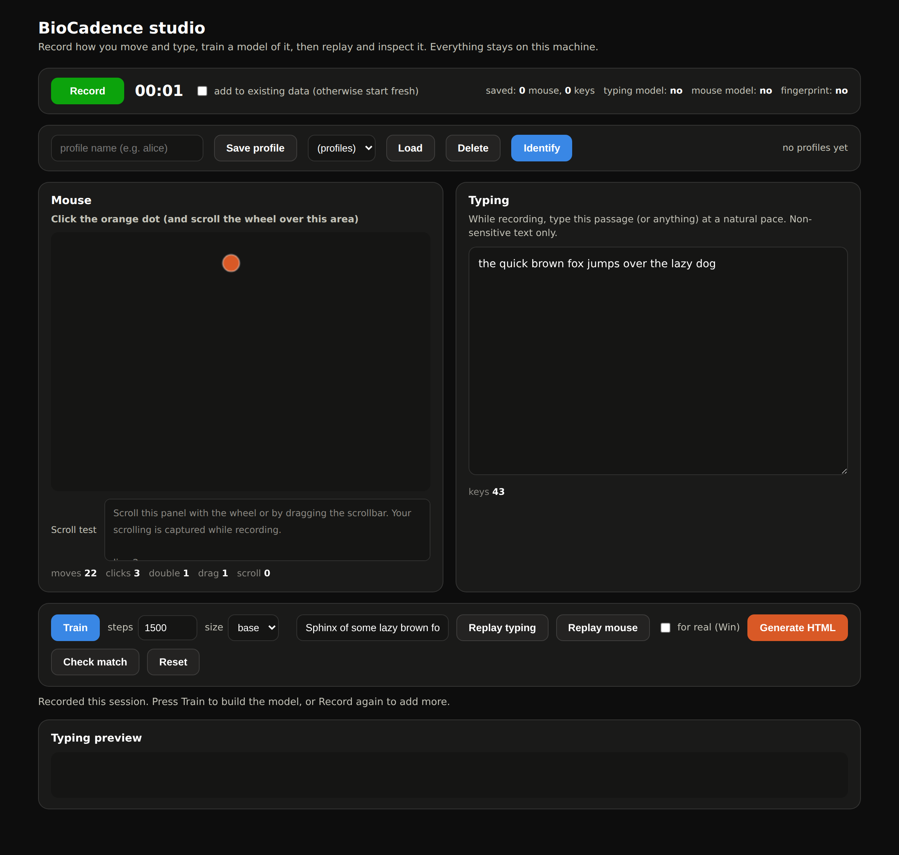
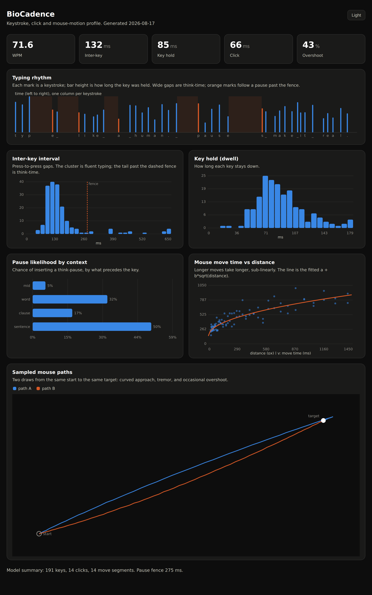

# BioCadence

Model your own typing, clicking and mouse motion, then replay it as
human-like input on Windows through the SendInput API.

This is not a macro recorder that plays back one fixed take. It learns the
statistics of how you type and move (key hold times, per-digraph rhythm,
think-time pauses, click timing, mouse curvature and overshoot) and then
generates fresh input for any new text or action that has the same feel:
bursts and hesitations, curved approaches, the occasional overshoot and
correction.

## Screenshots

The studio: record, train, replay, inspect and match, all in your browser.



The generated HTML report is a full inspector of your input-style model,
typing rhythm, timing distributions, pause structure, and sampled mouse paths.



## The pipeline

There are three stages.

Record. `recorder.py` uses pynput to capture a real session to a JSONL log of
timed events (every key press and release, mouse button, mouse move, scroll).
Run it on the machine whose style you want to model.

Model. `features.py` turns raw events into features (dwell, press-to-press
flight, click durations, mouse-segment geometry, and the burst/pause
structure). `model.py` fits distributions to those features and can sample
from them. The model saves to a small portable JSON file.

Replay. `planner.py` turns high-level actions ("type this", "move here",
"click") into a concrete, timed stream of primitive ops by sampling the model.
`replay_win.py` injects that stream through Windows SendInput with
sub-millisecond timing.

## Platform

Recording, modeling, the studio, the report, the fingerprint and profiles run
on Windows, Linux and macOS. Injecting generated input into the operating
system, the live replay that actually moves the mouse and types, uses the
Windows SendInput API and runs on Windows only. On other systems you can still
record, train, analyze and preview everything.

## Install

BioCadence is a normal Python package (Python 3.9+). Clone and install it:

```
git clone https://github.com/lucduguaysita/biocadence.git
cd biocadence
pip install .            # add -e for an editable/dev install
```

That installs the core dependency (numpy) and adds a `biocadence` command
(`biocadence ...` and `python -m biocadence ...` are equivalent). To record your
own sessions, also install pynput:

```
pip install "biocadence[record]"       # or just: pip install pynput
```

### PyTorch: CPU-only or Nvidia RTX

You only need PyTorch for the optional neural pointer model (`neural-train` /
`neural-replay`). Everything else, including the studio, replay, the report,
the fingerprint and profiles, runs on numpy alone, so skip this if you are not
training the neural mouse model.

Install the build that matches your machine. The always-current commands live
on the official selector at https://pytorch.org/get-started/locally; these are
the usual two.

CPU only (any computer, no GPU required):

```
pip install torch --index-url https://download.pytorch.org/whl/cpu
```

Nvidia GPU such as an RTX card (CUDA build; pick the CUDA version that matches
your driver from the selector, cu121 shown here as an example):

```
pip install torch --index-url https://download.pytorch.org/whl/cu121
```

Check that the GPU is visible:

```
python -c "import torch; print(torch.cuda.is_available(), torch.cuda.get_device_name(0) if torch.cuda.is_available() else 'CPU only')"
```

Training uses the GPU automatically when a CUDA device is available and falls
back to CPU otherwise. The model is small, so even CPU training finishes in
minutes for a modest recording; an RTX card just lets you use the larger presets
and more steps. If you already have a CUDA PyTorch environment (a deep-learning
setup, or an app that ships its own Python), you can run BioCadence with that
interpreter and skip installing torch again.

## Quick start

```
biocadence ui
```

This opens the studio in your browser. Press Record, type a little and click the
targets, press Stop, then Train, and use Replay, Generate HTML and Check match.
Everything is written to the working directory (change it with `--workdir`).
Prefer the command line? See the sections below.

## Try it with no hardware

The `demo` command fabricates a realistic session, trains a model on it, and
plans a sample, so you can see the whole pipeline run anywhere (it does not
touch your keyboard or mouse):

```
python -m biocadence demo --out-dir demo_out
python -m biocadence report --model demo_out/me.model.json --out demo_out/report.html
```

Open `demo_out/report.html` to inspect the fitted model: the typing rhythm
strip, interval and dwell distributions, pause likelihood by context, the
mouse move-time fit, and sampled trajectories.

## Studio (web UI)

For a point-and-click workflow instead of the command line, launch the studio:

```
python -m biocadence ui
```

It opens a local page (nothing leaves your machine) with a mouse training box
(click the random targets so it captures your motion, clicks and scroll), a
typing box, and buttons to Train, Replay the sample text as an animated
preview, and Generate the HTML report. The "type it for real" checkbox injects
the sample through SendInput on Windows instead of previewing. The captured
session is saved to me.jsonl in the workdir, so you can also feed it to
neural-train. Use --port and --workdir to change the port or output location.
It needs only the standard library and numpy, so it runs on a stock Python
install.

## Real use on Windows

Record yourself typing some non-sensitive text and moving the mouse around.
Press F12 to stop.

```
python -m biocadence record --out me.jsonl
```

Train a model (you can pass several recordings; they combine):

```
python -m biocadence train me.jsonl --out me.model.json
python -m biocadence inspect --model me.model.json
```

Preview a plan without touching your input (works on any OS), then run it for
real. On a live run there is a 3 second lead-in so you can focus the target
window; hold F12 to abort.

```
python -m biocadence replay --model me.model.json --text "Hello, world." --dry-run --verbose
python -m biocadence replay --model me.model.json --text "Hello, world."
```

Add natural typos that get corrected with backspace, and vary the run with a
seed:

```
python -m biocadence replay --model me.model.json --text "the quick brown fox" --typo-rate 0.03 --seed 7
```

## Actions

For anything beyond plain typing, pass an action list as JSON with
`--actions acts.json`. Coordinates are absolute screen pixels.

```json
[
  {"type": "move",  "to": [1240, 720]},
  {"type": "click", "button": "left"},
  {"type": "type",  "text": "Sphinx of black quartz, judge my vow."},
  {"type": "key",   "token": "Key.enter"},
  {"type": "pause", "seconds": 0.8},
  {"type": "click", "to": [360, 240], "double": true}
]
```

You can also build and save a plan, then replay it later without the model:

```
python -m biocadence plan --model me.model.json --actions acts.json --out plan.json
python -m biocadence replay --model me.model.json --plan plan.json
```

## How the model works

Typing timing is two things per key. Dwell is how long the key is held,
modeled as a log-normal per key with backoff to a key class then a global
distribution. Flight is the press-to-press latency from the previous key,
modeled as a log-normal per digraph (ordered key pair) with the same backoff.
Using press-to-press latency lets fast keys overlap, like real rollover.

Think-time is modeled as an additive pause on top of the fluent flight:

```
flight = fluent_base + (pause if a pause is triggered)
```

Each context (mid-word, after a word, after a clause, after a sentence) has
its own probability of triggering a pause and its own pause-size distribution.
Fluent latencies are learned from the fast, unpaused transitions; anything
past a data-derived fence is treated as think-time. This is what makes
generated typing breathe instead of tick like a metronome.

Clicks contribute a press-to-release duration and an inter-click interval,
each log-normal, plus a double-click rate.

Mouse movement time follows a Fitts-style fit, duration is about
`a + b*sqrt(distance)` with log-normal noise. Each generated move is a curved
Bezier whose curvature, path inefficiency and overshoot are sampled from
fitted distributions, then sampled in time with a minimum-jerk velocity
profile and a little perpendicular tremor that fades to zero at the endpoints
so landings stay precise.

## Injection details

Characters are injected as Unicode by default (`KEYEVENTF_UNICODE`), which is
layout independent and needs no manual shift handling. Special keys (enter,
backspace, arrows, and so on) go in as hardware scan codes with the extended
flag where appropriate. Pass `--scancode` to inject characters as scan codes
too, for apps or games that only read scan codes. Mouse moves use absolute
virtual-desktop coordinates so multi-monitor setups map correctly.

Timing is driven by raising the system timer resolution
(`timeBeginPeriod(1)`) and a hybrid wait that sleeps most of each gap and spins
the last millisecond, so the emitted schedule is followed closely rather than
being rounded up to the default 15 ms tick.

## Files

```
biocadence/
  schema.py      event schema and shared helpers
  recorder.py    pynput capture -> raw JSONL (Windows/any OS)
  features.py    raw events -> timing and motion features
  model.py       fit + sample the model; save/load JSON
  planner.py     actions -> concrete timed op stream
  replay_win.py  Windows SendInput injector (ctypes)
  synth.py       synthetic trace generator (for the demo and tests)
  viz.py         self-contained HTML model inspector
  cli.py         command line entry point
  neural/        optional learned pointer model (PyTorch)
    tokenizer.py   pointer events <-> integer token stream
    model.py       compact decoder-only transformer
    dataset.py     token windows for training
    train.py       CUDA-aware training loop
    sample.py      sampling, gesture extraction, retarget -> op stream
```

## Neural pointer model (optional)

The statistical model above uses hand-crafted distributions plus a min-jerk
prior. The neural path instead learns your pointer behavior directly: a small
decoder-only transformer (nanoGPT style) trained from scratch on a tokenized
stream of your own moves, clicks and scrolls. It captures joint, sequential
structure the parametric model approximates: how velocity evolves through a
move, correlated micro-motion, click cadence, scroll bursts, and drag dynamics.
It models the pointer channel only; keystrokes stay on the statistical model.

Drag and text-selection are not special-cased. Mechanically both are a left
button held down across a run of moves, so the model learns them from data;
text-selection as an intent is just a drag over text.

How the tokens work: each pointer event becomes a small group of tokens, a
quantized time delta plus either a move (quantized dx, dy) or an event token
(button down/up, scroll). Positions are relative, so the model is translation
invariant. To aim the learned style at a real target, the sampler pulls an
approach-and-click gesture from a pool of sampled behavior, then rotates and
scales it so its net displacement lands exactly on the target: the curvature,
micro-timing and click dwell are the model's, only the aim is imposed.

This needs PyTorch (see Install above for the CPU or CUDA build). First record
some varied pointer activity (move around, click, drag, select, scroll), then
train:

```
biocadence neural-train me.jsonl --out me.pointer.pt --preset large --steps 8000
```

The presets are tiny, base and large; on a GPU with plenty of memory use large
(it is still a small model and trains in minutes). Training uses the GPU
automatically when one is available and CPU otherwise. Then sample and inject,
either to a single point or from an action list:

```
biocadence neural-replay --model me.pointer.pt --to 1240 720 --cursor 960 540 --dry-run
biocadence neural-replay --model me.pointer.pt --actions acts.json
```

Pace: real pointer moves accelerate to a mid-flight peak and decelerate into
the target. With limited data the network tends toward a flatter, more constant
speed, so the sampler reshapes the timing along a min-jerk profile blended with
the model. Control it with --profile on neural-replay: 0 is the model's raw
timing, 1 is a full ease-in-ease-out, and the default 0.6 keeps the learned
path and landing while giving a human pace. More real training data lets you
lower it.

Data matters here. Unlike the statistical model, which is fine with a few
minutes of recording, a from-scratch neural model wants more of your own data
to beat that baseline: think tens of minutes to a few hours of varied pointer
use, or it will overfit and feel worse. The natural next upgrade is
goal-conditioning (feeding the remaining-offset-to-target into the network so
it steers itself, rather than retargeting a sampled gesture geometrically); the
tokenizer and training path are already set up for it.

## Behavioral fingerprint

The studio can also derive a behavioral fingerprint: a stable feature vector
built from the statistical model (dwell, flight, pause, click and mouse-motion
summaries) that clusters for the same person across sessions. It is built from
the statistical parameters on purpose, since those are stable per person; the
neural weights, with their random initialization, would never reproduce. Press
Train to enroll it, then record a fresh sample and press Check match to score
how likely the sample is the same person, with a match percentage and a
certainty level.

From the command line:

```
python -m biocadence fingerprint me.jsonl --out me.fp.json
python -m biocadence match --enrolled me.fp.json --sample new_session.jsonl
```

Matching compares each feature in units of its own noise: a bootstrap standard
error plus a per-feature session-to-session floor, so unreliable features
(mouse stats from wherever the targets happened to be) are down-weighted while
stable keystroke-timing features carry the signal, and a gently trimmed
aggregate keeps one flaky feature from tanking a genuine match. In testing the
same person across sessions scored above 95 percent while a clearly different
timing profile scored under 40. This is probabilistic behavioral matching, not
a secure or cryptographic identifier, so treat it as one soft signal and never
as the sole basis for a security decision.

### Profiles

To test with more than one person, save named profiles. Enter a name and press
Save profile, and the current recording, models and fingerprint are stored
under `profiles/<name>/` in the workdir. Load brings a profile back as the
active model and fingerprint, and Delete removes it. Identify records a fresh
sample and ranks it against every saved profile, so you can hand the keyboard
to a friend and see which enrolled person the new sample matches best. Each
profile is just a folder of files, so profiles are easy to back up or share.

## A note on responsible use

The recorder captures the actual characters you type, so treat a recording
like a keylog: record only non-sensitive text, keep the files local, and
delete them when done. The point of this project is to reproduce your own
input style on your own machine (for automation of your own repetitive tasks,
for testing, or for studying your own patterns). Driving software with
generated input can violate the rules or terms of service of that software, so
check them first, and do not use this to impersonate other people or to get
around security controls that exist to keep automated input out.

## Limits and extension ideas

The mouse model is aggregate rather than per-target, so it captures the feel
of your movement but not target-specific habits; a per-region or per-widget
model would go further. The think-time model is a context-conditioned mixture
rather than a full sequence model; an HMM or a small learned burst model over
inter-key intervals would capture longer-range rhythm. The typo model is a
simple neighbor-key-then-backspace process; a richer one could model
transpositions, double letters and delayed corrections. All of these plug into
the same features -> model -> planner path.
